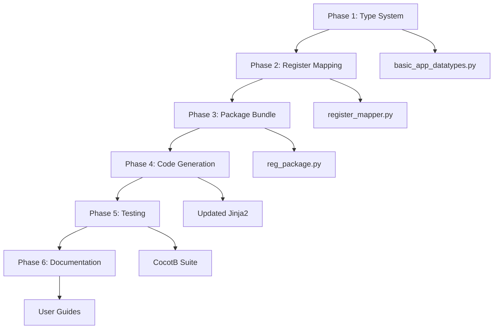

# BasicAppDataTypes (BAD) Master Orchestrator

**Created:** 2025-11-02
**Last Updated:** 2025-01-02 (Phase 2 complete)
**Purpose:** Master index and progress tracker for BasicAppDataTypes implementation

## Overview

This document orchestrates the implementation of BasicAppDataTypes - a fundamental upgrade to the EZ-EMFI custom instrument architecture that provides:
- Type-safe data serialization between Python and VHDL
- Automatic register mapping and bit packing
- Built-in support for voltage, time, and boolean types

## Phase Status Tracker

| Phase | File | Status | Branch | Merged | Summary | Commit |
|-------|------|--------|--------|--------|---------|--------|
| 1 | [BAD_Phase1_TypeSystem.md](./BAD_Phase1_TypeSystem.md) | 🟢 Complete | `feature/BAD/P1` | ✅ | [BAD_Phase1_COMPLETE.md](./BAD_Phase1_COMPLETE.md) | `1701df9` |
| 2 | [BAD_Phase2_RegisterMapping.md](./BAD_Phase2_RegisterMapping.md) | 🟢 Complete | `feature/BAD/P2` | ✅ | [BAD_Phase2_COMPLETE.md](./BAD_Phase2_COMPLETE.md) | `314d083` |
| 3 | [BAD_Phase3_RegPackage_r2.md](./BAD_Phase3_RegPackage_r2.md) | 🟡 Ready (r2) | `feature/BAD/P3` | ❌ | `BAD_Phase3_COMPLETE.md` | - |
| 4 | [BAD_Phase4_CodeGeneration.md](./BAD_Phase4_CodeGeneration.md) | 🔴 Not Started | `feature/BAD/P4` | ❌ | `BAD_Phase4_COMPLETE.md` | - |
| 5 | [BAD_Phase5_Testing.md](./BAD_Phase5_Testing.md) | 🔴 Not Started | `feature/BAD/P5` | ❌ | `BAD_Phase5_COMPLETE.md` | - |
| 6 | [BAD_Phase6_Documentation.md](./BAD_Phase6_Documentation.md) | 🔴 Not Started | `feature/BAD/P6` | ❌ | `BAD_Phase6_COMPLETE.md` | - |

**Legend:**
- **Status:** 🔴 Not Started | 🟡 In Progress | 🟢 Complete | ⚠️ Blocked
- **Merged:** ✅ Merged to feature/BAD | ❌ Not merged

## Quick Start

1. **Starting a Phase:**
   ```bash
   # Open the phase prompt in Claude
   cat docs/BasicAppDataTypes/BAD_Phase{N}_{Name}.md
   ```

2. **Completing a Phase:**
   - Phase creates `BAD_Phase{N}_COMPLETE.md` with results
   - Updates next phase's prompt with context
   - Commits with message: `feat(BAD): Complete Phase {N} - {description}`

3. **Checking Progress:**
   ```bash
   # View all phase summaries
   ls docs/BasicAppDataTypes/BAD_Phase*_COMPLETE.md

   # Check git history
   git log --oneline --grep="feat(BAD)"
   ```

## Git Workflow

### Branch Structure

```
main
└── feature/BAD-main (feature branch)
    ├── feature/BAD/P1 (phase 1: type system)
    ├── feature/BAD/P2 (phase 2: register mapping)
    ├── feature/BAD/P3 (phase 3: package model)
    ├── feature/BAD/P4 (phase 4: code generation)
    ├── feature/BAD/P5 (phase 5: testing)
    └── feature/BAD/P6 (phase 6: documentation)
```

### Starting a Phase

```bash
# Ensure you're on feature/BAD-main
git checkout feature/BAD-main

# Create phase branch
git checkout -b feature/BAD/P{N}

# Example for Phase 1:
git checkout -b feature/BAD/P1
```

### Working on a Phase

```bash
# Make changes, commit frequently
git add <files>
git commit -m "feat(BAD/P{N}): <description>"

# Example commits during Phase 1:
git commit -m "feat(BAD/P1): Add BasicAppDataTypes enum"
git commit -m "feat(BAD/P1): Implement voltage conversion utilities"
git commit -m "feat(BAD/P1): Add type registry with metadata"
```

### Completing a Phase

```bash
# Final commit on phase branch
git add <files>
git commit -m "feat(BAD/P{N}): Complete Phase {N} - <description>"

# Switch back to feature branch
git checkout feature/BAD-main

# Merge with merge commit (preserves history)
git merge --no-ff feature/BAD/P{N} -m "Merge Phase {N}: <description>"

# Example for Phase 1:
git checkout feature/BAD-main
git merge --no-ff feature/BAD/P1 -m "Merge Phase 1: Core type system implementation"
```

### Updating This Orchestrator

After merging a phase, update the status table:

```markdown
| 1 | ... | 🟢 Complete | feature/BAD/P1 | ✅ | BAD_Phase1_COMPLETE.md | abc123f |
```

### Final Merge to Main

Once all phases are complete and tested:

```bash
git checkout main
git merge --no-ff feature/BAD-main -m "feat: Add BasicAppDataTypes system

Complete implementation of BasicAppDataTypes with:
- Type-safe register communication
- Automatic register mapping (50-75% space savings)
- Comprehensive testing and documentation

See docs/BasicAppDataTypes/ for details."
```

## High-Level Goals

### Primary Objectives
1. **Replace manual bit-slicing** with type-aware serialization
2. **Eliminate register waste** through automatic packing
3. **Provide type safety** in both Python and VHDL domains
4. **Maintain backwards compatibility** with existing instruments

### Success Metrics
- [ ] DS1140_PD uses 50% fewer registers after migration
- [ ] Zero manual bit manipulation in application code
- [ ] All voltage/time conversions automated
- [ ] Existing CocotB tests pass with new system
- [ ] Migration path documented and tested

## Architecture Overview

```
Python Domain                    Network                    VHDL Domain
─────────────                    ───────                    ───────────
BasicAppDataTypes                                          std_logic_vector
    ↓                                                             ↑
Type Serializer  ──→  12 x 32-bit Registers (CR6-17)  ──→  Type Deserializer
    ↓                                                             ↑
Python App                                                   VHDL App
```

## Key Design Constraints

1. **Register Limits:**
   - 16 total Control Registers (platform limit)
   - 12 available for apps (CR4-CR15)
   - 4 reserved for internal use (CR0-CR3)
   - Each register is 32 bits wide

2. **Type Requirements:**
   - Fixed bit width per type (no dynamic sizing)
   - MSB-aligned packing
   - No endianness concerns
   - Deterministic serialization

3. **Compatibility:**
   - Existing RegisterType enum preserved
   - YAML schema extended, not replaced
   - Code generator supports both old and new formats

## Phase Dependencies



## File Structure

```
docs/BasicAppDataTypes/
├── BAD_MASTER_Orchestrator.md          # This file
├── BAD_Phase1_TypeSystem.md           # Core type definitions
├── BAD_Phase1_COMPLETE.md             # Phase 1 results (generated)
├── BAD_Phase2_RegisterMapping.md      # Auto-mapping algorithm
├── BAD_Phase2_COMPLETE.md             # Phase 2 results (generated)
├── BAD_Phase3_RegPackage.md          # Package bundling
├── BAD_Phase3_COMPLETE.md            # Phase 3 results (generated)
├── BAD_Phase4_CodeGeneration.md      # Template updates
├── BAD_Phase4_COMPLETE.md            # Phase 4 results (generated)
├── BAD_Phase5_Testing.md             # Validation suite
├── BAD_Phase5_COMPLETE.md            # Phase 5 results (generated)
├── BAD_Phase6_Documentation.md       # Final documentation
└── BAD_Phase6_COMPLETE.md            # Phase 6 results (generated)
```

## Context Files for All Phases

These files provide essential context across all phases:

### Core Custom Instrument Files
- `models/custom_inst/custom_inst_app.py` - Main app model
- `models/custom_inst/app_register.py` - Current register types
- `shared/custom_inst/templates/custom_inst_shim_template.vhd` - Shim template
- `shared/custom_inst/templates/custom_inst_main_template.vhd` - Main template
- `tools/generate_custom_inst.py` - Code generator

### Example Applications
- `DS1140_PD_app.yaml` - Target for migration
- `VHDL/apps/DS1140_PD/*.vhd` - Current implementation

### Infrastructure
- `shared/custom_inst/custom_inst_common_pkg.vhd` - Common VHDL utilities
- `VHDL/packages/ds1120_pd_pkg.vhd` - Example type conversions

### Moku Platform Specifications (moku-models/)
BasicAppDataTypes must work across **all 4 Moku platforms**. Platform specs are in the `moku-models` git submodule:

**Essential Platform References:**
- `moku-models/docs/MOKU_PLATFORM_SPECIFICATIONS.md` - Comprehensive hardware specs (310 lines)
- `moku-models/moku_models/platforms/moku_go.py` - Moku:Go model (125 MHz, 12-bit ADC/DAC)
- `moku-models/moku_models/platforms/moku_lab.py` - Moku:Lab model (500 MHz, 12-bit ADC/16-bit DAC)
- `moku-models/moku_models/platforms/moku_pro.py` - Moku:Pro model (1.25 GHz, 10-bit ADC)
- `moku-models/moku_models/platforms/moku_delta.py` - Moku:Delta model (5 GHz, 14-bit ADC, flagship)
- `moku-models/moku_models/moku_config.py` - Central deployment abstraction

**Platform Comparison:**

| Platform | Clock | ADC | DAC | Input Range | Output Range | Slots |
|----------|-------|-----|-----|-------------|--------------|-------|
| Moku:Go | 125 MHz | 12-bit | 12-bit | ±25V | ±5V | 2 |
| Moku:Lab | 500 MHz | 12-bit | 16-bit | ±5V | ±1V | 2 |
| Moku:Pro | 1.25 GHz | 10-bit* | 16-bit | ±20V | ±5V | 4 |
| Moku:Delta | 5 GHz | 14-bit* | 14-bit | ±20V | ±5V | 3 |

\* Blended ADC architectures (Pro: 10-bit + 18-bit, Delta: 14-bit + 20-bit)

**Platform-Critical Phases:**
- **Phase 1 (Type System)**: Voltage/time types must cover all platforms - ✅ Updated with platform context
- **Phase 4 (Code Generation)**: VHDL templates need platform-specific clocks - ⚠️ CRITICAL
- **Phase 5 (Testing)**: CocotB tests should validate all platforms - ⚠️ CRITICAL
- Phases 2, 3, 6 are platform-agnostic (software-only)

## Workflow Guidelines

### Starting Fresh
When starting a phase in a new Claude session:
1. Create phase branch: `git checkout -b feature/BAD/P{N}` (see [Git Workflow](#git-workflow))
2. Load the phase prompt completely
3. Check for previous phase summaries (`BAD_Phase{N-1}_COMPLETE.md`)
4. Review any git commits with `feat(BAD/P{N})` prefix
5. Begin interactive work on the phase

### Handoff Protocol
When completing work in a session:
1. Save all work in progress
2. Create phase summary file (`BAD_Phase{N}_COMPLETE.md`)
3. Commit to phase branch: `git commit -m "feat(BAD/P{N}): Complete Phase {N}"`
4. Merge to feature/BAD-main: `git merge --no-ff feature/BAD/P{N}` (see [Git Workflow](#git-workflow))
5. Update this orchestrator's status table
6. Note any blockers or decisions needed

### Decision Log
Track key decisions here as phases progress:

| Date | Phase | Decision | Rationale |
|------|-------|----------|-----------|
| 2025-11-02 | Setup | Use 12 registers for apps | Reserve 4 for future internal use |
| 2025-11-02 | Setup | MSB-aligned packing | Consistent with current architecture |
| 2025-11-02 | P1 | Modular file structure (6 files) | Clean separation, easier to navigate |
| 2025-11-02 | P1 | 23 types (not 25) | Time system needs 10 types, not 12 |
| 2025-11-02 | P1 | Separate python_tests/ directory | Avoid CocotB test conflicts |
| 2025-11-02 | P3 | Revision 2 spec created | Fixed TypeConverter integration, removed legacy types, clarified human-friendly units |

## Notes for Implementation

- Each phase prompt is self-contained and can run in a fresh Claude session
- Phase summaries cascade forward (each phase reads previous summaries)
- Git commits provide audit trail and rollback capability
- This orchestrator is the single source of truth for progress

## Getting Help

If you get stuck:
1. Check the phase's summary file for last known state
2. Review git log for recent changes
3. Consult CLAUDE.md for project conventions
4. Reference docs/BasicAppDataTypes-Mapping.md for original requirements

---

**Last Updated:** 2025-11-02 (Phase 3 r2 ready for implementation)
**Next Action:** Start Phase 3 using `P3_START_prompt_r2.md` or `BAD_Phase3_RegPackage_r2.md`