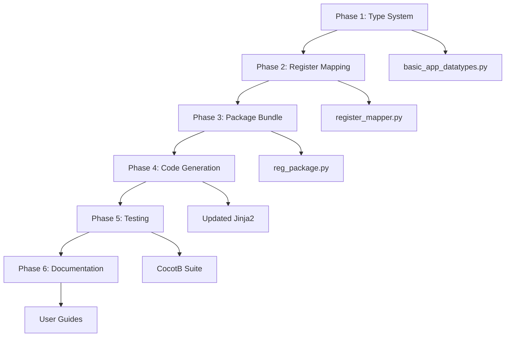

# BasicAppDataTypes (BAD) Master Orchestrator

**Created:** 2025-11-02
**Purpose:** Master index and progress tracker for BasicAppDataTypes implementation

## Overview

This document orchestrates the implementation of BasicAppDataTypes - a fundamental upgrade to the EZ-EMFI custom instrument architecture that provides:
- Type-safe data serialization between Python and VHDL
- Automatic register mapping and bit packing
- Built-in support for voltage, time, and boolean types

## Phase Status Tracker

| Phase | File | Status | Summary Location | Git Commit |
|-------|------|--------|------------------|------------|
| 1 | [BAD_Phase1_TypeSystem.md](./BAD_Phase1_TypeSystem.md) | 🔴 Not Started | `BAD_Phase1_COMPLETE.md` | - |
| 2 | [BAD_Phase2_RegisterMapping.md](./BAD_Phase2_RegisterMapping.md) | 🔴 Not Started | `BAD_Phase2_COMPLETE.md` | - |
| 3 | [BAD_Phase3_RegPackage.md](./BAD_Phase3_RegPackage.md) | 🔴 Not Started | `BAD_Phase3_COMPLETE.md` | - |
| 4 | [BAD_Phase4_CodeGeneration.md](./BAD_Phase4_CodeGeneration.md) | 🔴 Not Started | `BAD_Phase4_COMPLETE.md` | - |
| 5 | [BAD_Phase5_Testing.md](./BAD_Phase5_Testing.md) | 🔴 Not Started | `BAD_Phase5_COMPLETE.md` | - |
| 6 | [BAD_Phase6_Documentation.md](./BAD_Phase6_Documentation.md) | 🔴 Not Started | `BAD_Phase6_COMPLETE.md` | - |

**Legend:** 🔴 Not Started | 🟡 In Progress | 🟢 Complete | ⚠️ Blocked

## Quick Start

1. **Starting a Phase:**
   ```bash
   # Open the phase prompt in Claude
   cat docs/BasicAppDataTypes/BAD_Phase{N}_{Name}.md
   ```

2. **Completing a Phase:**
   - Phase creates `BAD_Phase{N}_COMPLETE.md` with results
   - Updates next phase's prompt with context
   - Commits with message: `feat(BAD): Complete Phase {N} - {description}`

3. **Checking Progress:**
   ```bash
   # View all phase summaries
   ls docs/BasicAppDataTypes/BAD_Phase*_COMPLETE.md

   # Check git history
   git log --oneline --grep="feat(BAD)"
   ```

## High-Level Goals

### Primary Objectives
1. **Replace manual bit-slicing** with type-aware serialization
2. **Eliminate register waste** through automatic packing
3. **Provide type safety** in both Python and VHDL domains
4. **Maintain backwards compatibility** with existing instruments

### Success Metrics
- [ ] DS1140_PD uses 50% fewer registers after migration
- [ ] Zero manual bit manipulation in application code
- [ ] All voltage/time conversions automated
- [ ] Existing CocotB tests pass with new system
- [ ] Migration path documented and tested

## Architecture Overview

```
Python Domain                    Network                    VHDL Domain
─────────────                    ───────                    ───────────
BasicAppDataTypes                                          std_logic_vector
    ↓                                                             ↑
Type Serializer  ──→  12 x 32-bit Registers (CR6-17)  ──→  Type Deserializer
    ↓                                                             ↑
Python App                                                   VHDL App
```

## Key Design Constraints

1. **Register Limits:**
   - 16 total Control Registers (platform limit)
   - 12 available for apps (CR4-CR15)
   - 4 reserved for internal use (CR0-CR3)
   - Each register is 32 bits wide

2. **Type Requirements:**
   - Fixed bit width per type (no dynamic sizing)
   - MSB-aligned packing
   - No endianness concerns
   - Deterministic serialization

3. **Compatibility:**
   - Existing RegisterType enum preserved
   - YAML schema extended, not replaced
   - Code generator supports both old and new formats

## Phase Dependencies



## File Structure

```
docs/BasicAppDataTypes/
├── BAD_MASTER_Orchestrator.md          # This file
├── BAD_Phase1_TypeSystem.md           # Core type definitions
├── BAD_Phase1_COMPLETE.md             # Phase 1 results (generated)
├── BAD_Phase2_RegisterMapping.md      # Auto-mapping algorithm
├── BAD_Phase2_COMPLETE.md             # Phase 2 results (generated)
├── BAD_Phase3_RegPackage.md          # Package bundling
├── BAD_Phase3_COMPLETE.md            # Phase 3 results (generated)
├── BAD_Phase4_CodeGeneration.md      # Template updates
├── BAD_Phase4_COMPLETE.md            # Phase 4 results (generated)
├── BAD_Phase5_Testing.md             # Validation suite
├── BAD_Phase5_COMPLETE.md            # Phase 5 results (generated)
├── BAD_Phase6_Documentation.md       # Final documentation
└── BAD_Phase6_COMPLETE.md            # Phase 6 results (generated)
```

## Context Files for All Phases

These files provide essential context across all phases:

### Core Custom Instrument Files
- `models/custom_inst/custom_inst_app.py` - Main app model
- `models/custom_inst/app_register.py` - Current register types
- `shared/custom_inst/templates/custom_inst_shim_template.vhd` - Shim template
- `shared/custom_inst/templates/custom_inst_main_template.vhd` - Main template
- `tools/generate_custom_inst.py` - Code generator

### Example Applications
- `DS1140_PD_app.yaml` - Target for migration
- `VHDL/apps/DS1140_PD/*.vhd` - Current implementation

### Infrastructure
- `shared/custom_inst/custom_inst_common_pkg.vhd` - Common VHDL utilities
- `VHDL/packages/ds1120_pd_pkg.vhd` - Example type conversions

## Workflow Guidelines

### Starting Fresh
When starting a phase in a new Claude session:
1. Load the phase prompt completely
2. Check for previous phase summaries
3. Review any git commits with `feat(BAD)` prefix
4. Begin interactive work on the phase

### Handoff Protocol
When completing work in a session:
1. Save all work in progress
2. Update the phase summary file
3. Commit with descriptive message
4. Update this orchestrator's status table
5. Note any blockers or decisions needed

### Decision Log
Track key decisions here as phases progress:

| Date | Phase | Decision | Rationale |
|------|-------|----------|-----------|
| 2025-11-02 | Setup | Use 12 registers for apps | Reserve 4 for future internal use |
| 2025-11-02 | Setup | MSB-aligned packing | Consistent with current architecture |

## Notes for Implementation

- Each phase prompt is self-contained and can run in a fresh Claude session
- Phase summaries cascade forward (each phase reads previous summaries)
- Git commits provide audit trail and rollback capability
- This orchestrator is the single source of truth for progress

## Getting Help

If you get stuck:
1. Check the phase's summary file for last known state
2. Review git log for recent changes
3. Consult CLAUDE.md for project conventions
4. Reference docs/BasicAppDataTypes-Mapping.md for original requirements

---

**Last Updated:** 2025-11-02
**Next Action:** Start Phase 1 using `BAD_Phase1_TypeSystem.md`